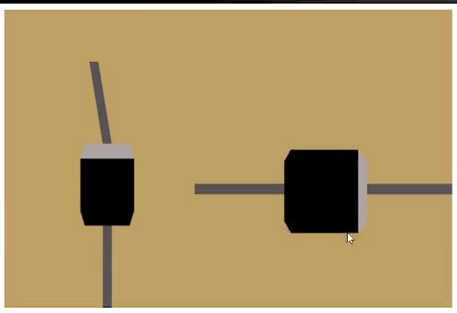
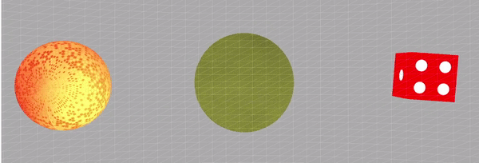

# tugas-1-fikrisandi

Nama                : Muhammad Fikri Sandi Pratama  
NRP                 : 05111940000195  
Kelas               : Grafika Komputer - D  
Keterangan Gambar   : Dioda  
Keterangan          :  
Gambar kiri -> Foto Belakang Atas  
Gambar Kanan -> Foto Kanan atas

### Depan Atas

### Belakang Atas

### Kanan Atas

### Kiri Atas

